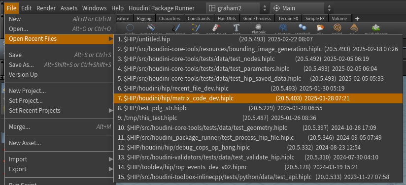

.. houdini-recent-files-menu documentation master file

houdini-recent-files-menu documentation
=======================================

The `houdini-recent-files-menu` package provides a more descriptive version of `Houdini's <http://sidefx.com>`_ **Open
Recent Files** main menu item.

It displays:

* The path to the hip file
* The Houdini version the hip file was last saved in
* The date + time the hip file was last opened

.. toctree::
   :maxdepth: 2
   :caption: Contents:

   installation.rst
   configuration.rst
   api/modules
